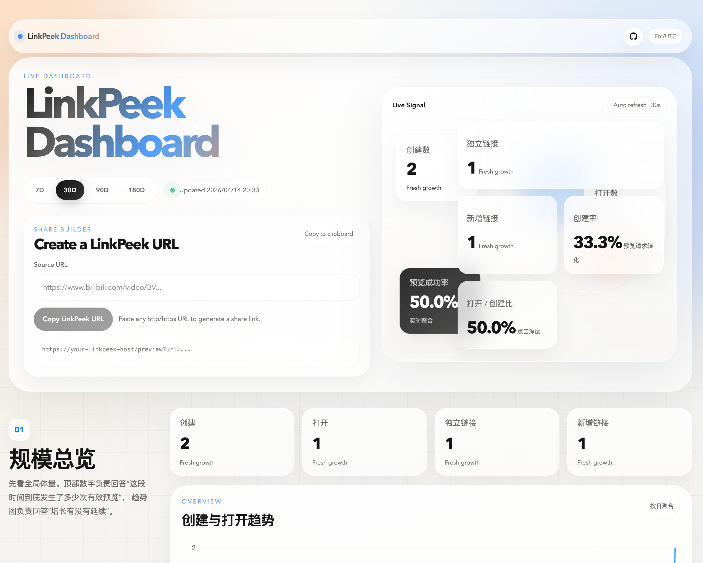

# LinkPeek

一句话简介：一个基于 Java 17 的链接预览代理服务，面向 iMessage 一类聊天分享场景，为受支持的第三方链接生成稳定的 Open Graph 预览页。

当前首个正式版本采用 `Spring Boot 3.x + Maven` 多模块结构，对外统一暴露 `GET /preview?url=...` 入口，内部通过 provider SPI 解析目标链接并输出预览 HTML。

[在线体验 Live Demo](https://linkpeek.cloud.jianyutan.com/dashboard)



## 功能特点

- 基于 `Java 17`、`Spring Boot 3.x`、`Maven` 实现，适合作为正式开源项目长期维护。
- 统一预览入口为 `GET /preview?url=...`，不再暴露平台专用旧路由。
- 当前内置 `Bilibili` provider，支持标准视频链接和 `b23.tv` 短链。
- 对爬虫请求返回 Open Graph HTML，对普通浏览器请求执行 `302` 跳转回原始链接。
- 提供本地磁盘缓存，缓存元数据和缩略图，减少重复抓取。
- 提供内部缩略图代理路由，`og:image` 指向服务自身地址，便于统一控制。
- 保留视频代理路由占位，但首版明确返回 `501 Not Implemented`，不引入外部二进制依赖。
- 内置 `SQLite + MyBatis` 统计子系统，自动采集创建、打开、失败和缩略图命中事件。
- 自带炫酷统计页，根路径自动跳转到 `/dashboard`，适合自部署后直接查看运营数据。
- 使用多模块组织方式，便于后续扩展更多 provider。

## 安装（Docker）

### 方式一：使用 `docker compose`

仓库已包含一个可直接启动的 `docker-compose.yml`：

```bash
docker compose up -d --build
```

默认监听 `8080` 端口。

建议启动前至少配置：

- `BASE_URL`：服务对外可访问的地址，例如 `https://preview.example.com`
- `WEB_ICON_PATH`：网页 favicon 文件路径，例如 `/data/favicon.svg` 或 `/data/favicon.ico`
- `CACHE_DIR`：缓存目录，默认 `/data/cache`
- `STATS_DB_PATH`：统计数据库路径，默认 `/data/stats/linkpeek.db`
- `CACHE_MAX_SIZE_GB`：缓存空间上限，默认 `10`
- 将整个 `/data` 做持久化挂载，统一保存缓存和统计库文件

### 方式二：使用 `docker run`

```bash
docker build -t linkpeek .

docker run --rm \
  -p 8080:8080 \
  -e BASE_URL=https://preview.example.com \
  -e WEB_ICON_PATH=/data/favicon.svg \
  -e CACHE_DIR=/data/cache \
  -e STATS_DB_PATH=/data/stats/linkpeek.db \
  -e CACHE_MAX_SIZE_GB=10 \
  -v "$PWD/data:/data" \
  linkpeek
```

### 生产部署建议

- 预览服务建议通过公网 `HTTPS` 暴露。
- 建议在前面放 `Nginx` 或 `Caddy` 做 TLS、访问日志和基础限流。
- `/data` 目录建议整体持久化挂载，避免容器重建后缓存和统计数据全部丢失。

## 快速开始 / 使用示例

### 1. 启动服务

```bash
docker compose up -d --build
```

### 2. 准备一个对外可访问的域名

例如：

```text
https://preview.example.com
```

并将其配置给环境变量 `BASE_URL`。

### 3. 分享预览链接

当前 Java 版统一使用通用入口：

```text
https://preview.example.com/preview?url=https%3A%2F%2Fwww.bilibili.com%2Fvideo%2FBV1xx411c7mD
```

也支持 `b23.tv` 短链：

```text
https://preview.example.com/preview?url=https%3A%2F%2Fb23.tv%2F5ox9FJX
```

行为说明：

- 当 iMessage 或其他爬虫访问该链接时，服务返回 Open Graph HTML。
- 当普通用户点击同一个链接时，服务会 `302` 跳转到原始 Bilibili 页面。

### 4. 本地验证抓取结果

模拟抓取器请求：

```bash
curl -A "facebookexternalhit/1.1" \
  "https://preview.example.com/preview?url=https%3A%2F%2Fwww.bilibili.com%2Fvideo%2FBV1xx411c7mD"
```

检查服务健康状态：

```bash
curl https://preview.example.com/api/health
```

返回：

```json
{"status":"ok"}
```

获取网页 favicon：

```bash
curl -I https://preview.example.com/favicon.ico
```

打开统计看板：

```text
https://preview.example.com/dashboard
```

查看 OpenAPI 文档：

```text
https://preview.example.com/doc.html
```

原始 OpenAPI JSON：

```text
https://preview.example.com/v3/api-docs
```

## 项目结构

```text
LinkPeek/
├── linkpeek-core/
│   └── 通用领域模型、错误模型、URL 规范化、provider SPI
├── linkpeek-provider-bilibili/
│   └── Bilibili URL 识别、短链解析、元数据抓取、缩略图下载
├── linkpeek-provider-template/
│   └── provider 开发模板
├── linkpeek-server/
│   └── Spring Boot 服务、路由、缓存、HTML 渲染、配置装配
├── docs/
│   ├── architecture.md
│   └── provider-development.md
├── .github/workflows/ci.yml
├── Dockerfile
├── docker-compose.yml
├── mvnw
├── mvnw.cmd
└── pom.xml
```

各模块职责：

- `linkpeek-core`：定义 `PreviewProvider`、`PreviewMetadata`、`PreviewKey` 等核心抽象。
- `linkpeek-provider-bilibili`：封装 Bilibili 平台相关逻辑，不把平台细节泄漏到 Web 层。
- `linkpeek-provider-template`：提供新增 provider 的最小骨架示例。
- `linkpeek-server`：负责 HTTP 接口、爬虫识别、缓存、OG HTML 输出和运行时配置。
- `linkpeek-server`：负责 HTTP 接口、爬虫识别、缓存、OG HTML 输出、SQLite 统计和 Dashboard 页面。

## 核心逻辑 / 关键流程

### 整体流程

```text
用户分享 /preview?url=<目标链接>
              |
              v
        服务校验并规范化 URL
              |
              v
        provider registry 选择 provider
              |
              v
  Bilibili 短链则先解析重定向为标准视频链接
              |
              v
      根据 canonical URL 生成 PreviewKey
              |
      +-------+-------+
      |               |
      v               v
  爬虫请求          普通浏览器请求
      |               |
      v               v
 查缓存 / 抓元数据      302 跳转到原始链接
      |
      v
 渲染 Open Graph HTML + 记录统计事件
      |
      v
 缩略图通过 /media/thumb/{previewKey}.jpg 按需下载与缓存
```

### 当前版本设计原则

- 对外只保留一个统一入口，避免平台路由继续膨胀。
- provider 负责平台识别、canonical 化和元数据解析。
- 服务层负责缓存、路由控制和 HTML 渲染。
- 统计页和聚合查询全部内置在服务端，不依赖独立前端工程。
- 首版优先保证预览链路稳定，不做纯 Java 的视频下载能力。

## API / 进阶用法

### HTTP API

#### `GET /`

重定向到内置统计页：

```text
302 /dashboard
```

#### `GET /api/health`

轻量健康检查接口。

#### `GET /favicon.ico`

返回当前 Web 页面使用的 favicon。

说明：

- 可通过环境变量 `WEB_ICON_PATH` 指定图标文件路径
- 支持常见的 `svg`、`png`、`ico` 等格式，返回时自动带上对应 Content-Type
- 未配置时会回退到应用内置默认图标

#### `GET /actuator/health`

Spring Boot Actuator 健康检查接口。

#### `GET /preview?url=<encoded-url>`

唯一公开预览入口。

行为：

- URL 非法时返回 `400`
- URL 合法但当前没有匹配的 provider 时返回 `422`
- 爬虫请求时返回 Open Graph HTML
- 普通浏览器请求时返回 `302` 跳转
- 在 Swagger UI 或本地调试时，可额外传 `X-LinkPeek-Render-Mode: crawler` 强制返回 HTML，避免浏览器跟随 302 后触发跨域限制

示例：

```text
GET /preview?url=https%3A%2F%2Fwww.bilibili.com%2Fvideo%2FBV1xx411c7mD
```

#### `GET /media/thumb/{previewKey}.jpg`

按需下载并缓存缩略图，OG HTML 中的 `og:image` 指向该地址。

#### `GET /media/video/{previewKey}.mp4`

为未来的视频代理预留。当前版本固定返回：

```text
501 Not Implemented
```

#### `GET /dashboard`

返回内置统计页，聚合展示三层指标：

- 规模总览
- 转化分析
- 内容洞察

#### `GET /api/stats/dashboard?range=30d`

返回统计页所需的聚合 JSON，支持时间窗：

- `7d`
- `30d`
- `90d`
- `180d`

#### `GET /doc.html`

Swagger UI 风格的 OpenAPI 文档页面，适合本地调试和联调时直接查看接口。

调试 `/preview` 时，建议在文档页里把请求头 `X-LinkPeek-Render-Mode` 填为 `crawler`，否则浏览器会按默认行为收到 `302` 跳转。

#### `GET /v3/api-docs`

OpenAPI JSON 文档原始输出，可供 Swagger UI、网关或其他工具消费。

### 配置项

所有主要配置都通过环境变量提供：

| 变量名 | 默认值 | 说明 |
| --- | --- | --- |
| `BASE_URL` | `http://localhost:8080` | 生成预览资源绝对地址时使用的服务基础地址 |
| `CACHE_DIR` | `/data/cache` | 本地缓存根目录 |
| `STATS_DB_PATH` | `/data/stats/linkpeek.db` | SQLite 统计库文件路径 |
| `CACHE_TTL_SECONDS` | `86400` | 元数据和缩略图缓存有效期 |
| `CACHE_MAX_SIZE_GB` | `10` | 缓存空间上限 |
| `STATS_RETENTION_DAYS` | `180` | 统计事件保留天数 |
| `DOWNLOAD_TIMEOUT` | `120s` | 上游请求超时时间 |
| `VIDEO_MAX_QUALITY` | `480` | 为未来视频能力预留，首版暂不启用 |
| `LOG_LEVEL` | `INFO` | 日志级别 |

### 进阶用法 1：新增 provider

后续扩展新平台时，建议：

1. 在独立模块中实现 `PreviewProvider`
2. 补齐 `supports()`、`canonicalize()`、`resolve()`
3. 如有需要实现 `downloadThumbnail()`
4. 在 `linkpeek-server` 中注册为 Spring Bean

参考文档：

- [架构说明](./docs/architecture.md)
- [Provider 开发指南](./docs/provider-development.md)
- [TemplatePreviewProvider](./linkpeek-provider-template/src/main/java/io/github/shigella520/linkpeek/provider/template/TemplatePreviewProvider.java)

### 进阶用法 2：本地开发

本地构建与测试：

```bash
./mvnw -B verify
```

本地启动服务：

```bash
CACHE_DIR=$PWD/.cache/linkpeek \
STATS_DB_PATH=$PWD/.data/linkpeek/stats.db \
./mvnw -pl linkpeek-server -am spring-boot:run
```

如果你想显式指定端口，也可以这样启动：

```bash
CACHE_DIR=$PWD/.cache/linkpeek \
STATS_DB_PATH=$PWD/.data/linkpeek/stats.db \
./mvnw -pl linkpeek-server -am spring-boot:run \
  -Dspring-boot.run.arguments=--server.port=8080
```

### 常见问题：`PKIX path building failed`

如果本地日志里出现类似下面的错误：

```text
javax.net.ssl.SSLHandshakeException: PKIX path building failed
```

这通常不是 LinkPeek 的业务逻辑问题，而是当前 Java 运行时不信任你机器当前看到的 HTTPS 证书链。最常见的场景是：

- 开着公司/校园网代理
- 开着 Clash、Surge、Charles、Fiddler 之类的 HTTPS 代理或抓包工具
- `curl` 走的是系统证书，而 Java 17 走的是自己独立的 truststore

你现在这个现象就是典型例子：`curl` 能访问 `https://api.bilibili.com`，但 Java `HttpClient` 握手失败。

建议按下面顺序处理：

1. 先关闭系统代理、抓包工具或 HTTPS 中间人代理，再重试启动服务。
2. 如果必须经过代理，把代理根证书导出为 `ca.crt`，导入当前 JDK 的 truststore：

```bash
keytool -importcert \
  -alias local-proxy-ca \
  -file /path/to/ca.crt \
  -keystore "$JAVA_HOME/lib/security/cacerts"
```

默认密码通常是 `changeit`。

3. 如果你不想改全局 JDK，也可以单独给本次启动指定 truststore：

```bash
CACHE_DIR=$PWD/.cache/linkpeek ./mvnw -pl linkpeek-server -am spring-boot:run \
  -Dspring-boot.run.arguments=--server.port=8080 \
  -Dspring-boot.run.jvmArguments='-Djavax.net.ssl.trustStore=/path/to/truststore.jks -Djavax.net.ssl.trustStorePassword=changeit'
```

4. 导入证书后，可以先用下面的命令验证 Java 侧是否恢复正常：

```bash
curl -A "facebookexternalhit/1.1" \
  "http://localhost:8080/preview?url=https%3A%2F%2Fwww.bilibili.com%2Fvideo%2FBV1McSQBEE71"
```

如果页面不再返回 `Preview Error`，说明证书链问题已经解决。

## 许可证

本项目使用 [MIT License](./LICENSE)。

这意味着：

- 允许自由使用、修改、分发和商用
- 只需保留原始版权声明和许可证文本
- 适合个人项目、开源项目和商业内部项目使用
