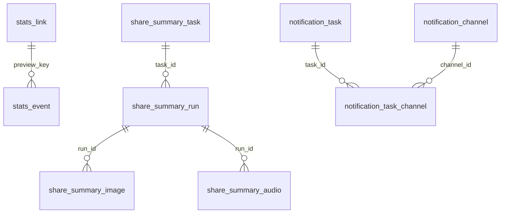

# 数据库表结构

LinkPeek 运行时使用 SQLite，默认路径由 `STATS_DB_PATH` 指定为 `/data/stats/linkpeek.db`。

当前 schema 的代码来源是：

```text
linkpeek-server/src/main/resources/db/stats-schema.sql
linkpeek-server/src/main/java/io/github/shigella520/linkpeek/server/config/StatisticsConfiguration.java
```

启动时会先执行 `stats-schema.sql`，再由 `StatisticsConfiguration` 做幂等列迁移、索引补齐和少量兼容性重建。当前 SQLite 配置使用 WAL、`synchronous=NORMAL`、5 秒 busy timeout，并关闭 foreign key enforcement。因此下文的关系是代码层逻辑关系，不是数据库物理外键。

## 总览

数据库承载四类数据：

- 预览统计：预览事件、链接维表和 Dashboard 聚合来源。
- 管理配置：Prompt、论坛 Cookie、AI Provider、AI Provider 降级配置。
- 分享总结：任务、执行记录、AI 分享图配置/记录、TTS 音频配置/记录。
- 通知系统：Webhook 渠道、通知任务、任务渠道关联和发送记录。



## 通用约定

- 所有时间字段都是 epoch milliseconds。
- SQLite 没有布尔类型，代码使用 `INTEGER` 保存布尔值：`0=false`，`1=true`。
- `provider_id` 有两种语义：
  - 统计表中的 `provider_id` 是内容 provider，例如 `bilibili`、`gaphub`、`v2ex`、`linuxdo`、`nga`。
  - `provider_config.provider_id` 是配置命名空间，例如 `linuxdo`、`nga`、`ai_title`、`ai_provider`。
- AI Provider 是后台配置的上游 AI 服务，保存在 `ai_provider` 表；它和内容 provider 不是同一个概念。
- Secret、Cookie、API Key、Prompt 等配置当前保存在 SQLite 中，应保护数据库文件权限和后台访问权限。

## stats_link

链接聚合维表，用于 Dashboard 热门链接、标题展示、首次/最近出现时间等查询。

| 字段 | 类型 | 约束 | 说明 |
| --- | --- | --- | --- |
| `preview_key` | `TEXT` | PK | 预览资源稳定标识。基础预览来自 canonical URL；AI styled 预览来自 canonical URL、style 和 prompt hash。 |
| `provider_id` | `TEXT` | 可空 | 内容 provider ID。失败事件或早期记录可能为空。 |
| `canonical_url` | `TEXT` | NOT NULL | provider 归一化后的目标 URL。 |
| `title` | `TEXT` | NOT NULL | 展示标题。事件先写入空标题时，后续 upsert 会用真实标题补齐。 |
| `site_name` | `TEXT` | NOT NULL | 站点名。 |
| `first_seen_at` | `INTEGER` | NOT NULL | 首次出现时间。 |
| `last_seen_at` | `INTEGER` | NOT NULL | 最近出现时间。 |

索引：

- `idx_stats_link_last_seen_at(last_seen_at)`

写入规则：

- 通过 `StatsLinkMapper.upsertLink` 写入。
- 冲突时保留更早的 `first_seen_at`，更新更晚的 `last_seen_at`。
- 新标题或站点名为空时，不覆盖已有非空值。

## stats_event

统计事件事实表，记录预览创建、打开、失败和媒体服务事件。

| 字段 | 类型 | 约束 | 说明 |
| --- | --- | --- | --- |
| `id` | `INTEGER` | PK AUTOINCREMENT | 自增事件 ID。 |
| `occurred_at` | `INTEGER` | NOT NULL | 事件发生时间。 |
| `event_type` | `TEXT` | NOT NULL | 当前包括 `PREVIEW_CREATED`、`PREVIEW_OPENED`、`PREVIEW_FAILED`、`THUMBNAIL_SERVED`。 |
| `preview_key` | `TEXT` | 可空 | 逻辑关联 `stats_link.preview_key`。URL 非法等场景可能为空。 |
| `provider_id` | `TEXT` | 可空 | 内容 provider ID。 |
| `http_status` | `INTEGER` | NOT NULL | 本次服务响应状态码。 |
| `cache_hit` | `INTEGER` | NOT NULL | 是否命中元数据、缩略图或视频缓存。 |
| `ai_requested` | `INTEGER` | NOT NULL DEFAULT 0 | 本次预览创建是否请求过 AI 标题。 |
| `ai_succeeded` | `INTEGER` | NOT NULL DEFAULT 0 | 本次 AI 标题是否成功生成并用于预览。 |
| `source_url` | `TEXT` | 可空 | 用户请求中的原始 URL。 |
| `requested_style` | `TEXT` | 可空 | 请求中的 style。 |
| `actual_style` | `TEXT` | 可空 | 实际命中的 style，`FREESTYLE` 会记录随机到的真实 style。 |
| `ai_provider_names` | `TEXT` | 可空 | 本次 AI 请求实际尝试过的 Provider 名称，按 `/` 拼接。 |
| `ai_duration_ms` | `INTEGER` | NOT NULL DEFAULT 0 | AI 标题请求总耗时。 |
| `crawl_duration_ms` | `INTEGER` | NOT NULL DEFAULT 0 | 上游抓取或 provider 解析耗时。 |
| `duration_ms` | `INTEGER` | NOT NULL | 本次服务端处理总耗时。 |
| `client_type` | `TEXT` | NOT NULL | 客户端类型，例如 crawler、browser、media。 |
| `error_code` | `TEXT` | 可空 | 失败分类，例如 `INVALID_URL`、`UNSUPPORTED_URL`、`UPSTREAM_ERROR`、`OTHER`。 |

索引：

- `idx_stats_event_occurred_at(occurred_at)`
- `idx_stats_event_type_occurred_at(event_type, occurred_at)`
- `idx_stats_event_preview_key(preview_key)`

清理规则：

- 统计过期清理会先删除旧事件，再删除没有事件引用的孤儿 `stats_link`。
- 管理后台清理全部统计数据会删除 `stats_event` 和 `stats_link`，不会删除后台配置。

## admin_prompt

Style Prompt 表，管理后台通过它维护 `style -> prompt`。

| 字段 | 类型 | 约束 | 说明 |
| --- | --- | --- | --- |
| `style` | `TEXT` | PK | 样式名。代码限制为 1-64 位，允许字母、数字、点、下划线和短横线。 |
| `prompt` | `TEXT` | NOT NULL | 该 style 对应的风格提示词。 |
| `updated_at` | `INTEGER` | NOT NULL | 最近更新时间。 |

`/api/preview/styles` 只返回 style 名称，不返回 prompt 内容。

## provider_config

通用运行配置 KV 表，主键为 `(provider_id, config_key)`。

| 字段 | 类型 | 约束 | 说明 |
| --- | --- | --- | --- |
| `provider_id` | `TEXT` | PK | 配置命名空间。 |
| `config_key` | `TEXT` | PK | 配置项 key。 |
| `config_value` | `TEXT` | NOT NULL | 配置值，按字符串保存。 |
| `updated_at` | `INTEGER` | NOT NULL | 最近更新时间。 |

当前主要配置：

| provider_id | config_key | 说明 |
| --- | --- | --- |
| `bilibili` | `ai_title_enabled` | Bilibili 是否启用 AI 标题；无记录或空值时默认启用。 |
| `linuxdo` | `_t` / `cf_clearance` / `_forum_session` | LinuxDo 上游请求 Cookie。 |
| `nga` | `NGA_PASSPORT_UID` / `NGA_PASSPORT_CID` | NGA 登录态。 |
| `ai_title` | `title_format_prompt` | AI 标题输出格式提示词；无记录时使用代码默认值。 |
| `ai_provider` | `auto_downgrade_enabled` | AI Provider 自动降级全局开关。 |
| `ai_provider` | `auto_downgrade_failure_threshold` | 触发自动降级的连续失败阈值，允许 `1..100`。 |
| `ai_provider` | `share_summary_timeout_multiplier` | 分享总结复用 AI Provider 时的超时倍数。 |

注意：

- 自动降级失败计数保存在进程内存中，服务重启后清空。
- 通用 Provider 配置接口没有 key 白名单；后台 UI 固定写入当前支持的 key。
- 旧的 AI Provider 超时降级配置会在启动迁移中删除。

## ai_provider

AI Provider 列表，用于 AI 标题和分享总结。代码按 `enabled=1`、`sort_order ASC`、`id ASC` 依次尝试。

| 字段 | 类型 | 约束 | 说明 |
| --- | --- | --- | --- |
| `id` | `INTEGER` | PK AUTOINCREMENT | 自增 ID。 |
| `name` | `TEXT` | NOT NULL | 管理后台展示名。 |
| `enabled` | `INTEGER` | NOT NULL | 是否启用。 |
| `sort_order` | `INTEGER` | NOT NULL | 排序号。 |
| `base_url` | `TEXT` | NOT NULL | AI API 基础地址，通常填到 `/v1`。 |
| `api_kind` | `TEXT` | NOT NULL DEFAULT `CHAT_COMPLETIONS` | API 格式，当前支持 Chat Completions 和 Responses 文本请求。 |
| `model` | `TEXT` | NOT NULL | 模型名。 |
| `effort` | `TEXT` | 可空 | 推理 effort。 |
| `request_timeout_seconds` | `INTEGER` | NOT NULL DEFAULT 45 | 单个 Provider 请求超时秒数，管理后台限制 `1..600`。 |
| `api_key` | `TEXT` | NOT NULL | API Key。 |
| `updated_at` | `INTEGER` | NOT NULL | 最近更新时间。 |

索引：

- `idx_ai_provider_enabled_sort(enabled, sort_order, id)`

排序规则：

- 新建 Provider 默认追加到当前最大 `sort_order + 100`。
- 手工拖拽排序和自动降级都会重写为 `100, 200, 300...`。
- 失败阈值降级触发时，Provider 会移动到列表最后；即使已经在最后，也会记录明显 WARN 日志和通知事件。

## share_summary_task

分享总结任务配置表。

| 字段 | 类型 | 约束 | 说明 |
| --- | --- | --- | --- |
| `id` | `INTEGER` | PK AUTOINCREMENT | 任务 ID。 |
| `name` | `TEXT` | NOT NULL | 任务名称。 |
| `enabled` | `INTEGER` | NOT NULL | 是否启用定时执行。 |
| `period_type` | `TEXT` | NOT NULL | `DAILY`、`WEEKLY`、`MONTHLY`。 |
| `period_selection_mode` | `TEXT` | NOT NULL DEFAULT `CURRENT` | `CURRENT` 或 `PREVIOUS`，决定窗口取当前周期截至触发点还是上一完整周期。 |
| `run_time` | `TEXT` | NOT NULL | `HH:mm`。 |
| `day_of_week` | `INTEGER` | 可空 | 周任务使用，`1..7` 表示周一到周日。 |
| `prompt` | `TEXT` | NOT NULL | 分享总结提示词。 |
| `max_links` | `INTEGER` | NOT NULL | 输入 AI 的最大去重链接数，允许 `1..2000`。 |
| `min_links` | `INTEGER` | NOT NULL DEFAULT 1 | 触发 AI 总结所需的最小去重链接数，允许 `1..2000`。 |
| `deleted` | `INTEGER` | NOT NULL DEFAULT 0 | 逻辑删除标记。 |
| `deleted_at` | `INTEGER` | 可空 | 逻辑删除时间。 |
| `created_at` | `INTEGER` | NOT NULL | 创建时间。 |
| `updated_at` | `INTEGER` | NOT NULL | 更新时间。 |

索引：

- `idx_share_summary_task_enabled(enabled, deleted, period_type)`

月任务没有单独的“几号”字段。`MONTHLY + CURRENT` 在月末指定时间执行，窗口是本月 1 日到触发时间；`MONTHLY + PREVIOUS` 在每月 1 日指定时间执行，窗口是上一完整自然月。

## share_summary_run

分享总结执行记录表。

| 字段 | 类型 | 约束 | 说明 |
| --- | --- | --- | --- |
| `id` | `INTEGER` | PK AUTOINCREMENT | 执行记录 ID。 |
| `task_id` | `INTEGER` | NOT NULL | 任务 ID。 |
| `task_name` | `TEXT` | NOT NULL | 执行时任务名称快照。 |
| `trigger_type` | `TEXT` | NOT NULL | `SCHEDULED`、`MANUAL`、`RETRY`。 |
| `period_type` | `TEXT` | NOT NULL | 执行时周期类型快照。 |
| `window_start` | `INTEGER` | NOT NULL | 总结窗口开始。 |
| `window_end` | `INTEGER` | NOT NULL | 总结窗口结束。 |
| `status` | `TEXT` | NOT NULL | `RUNNING`、`SUCCESS`、`EMPTY`、`FAILED`、`SKIPPED`。 |
| `link_count` | `INTEGER` | NOT NULL DEFAULT 0 | 窗口内原始创建事件数。 |
| `unique_link_count` | `INTEGER` | NOT NULL DEFAULT 0 | 去重后的链接标题数。 |
| `input_link_count` | `INTEGER` | NOT NULL DEFAULT 0 | 实际输入 AI 的标题数。 |
| `prompt_snapshot` | `TEXT` | NOT NULL | 执行时 Prompt 快照。 |
| `ai_provider_names` | `TEXT` | 可空 | 实际尝试或成功的 AI Provider 名称。 |
| `ai_duration_ms` | `INTEGER` | NOT NULL DEFAULT 0 | AI 总结耗时。 |
| `report` | `TEXT` | 可空 | 报告正文。 |
| `error_message` | `TEXT` | 可空 | 失败或 EMPTY 原因。 |
| `started_at` | `INTEGER` | NOT NULL | 开始时间。 |
| `finished_at` | `INTEGER` | 可空 | 结束时间。 |

索引：

- `idx_share_summary_run_task_window(task_id, window_start, window_end)`
- `idx_share_summary_run_started_at(started_at)`
- `idx_share_summary_run_status(status)`

同一任务同一窗口的定时记录如果已经是 `SUCCESS`、`EMPTY` 或 `RUNNING`，调度会跳过。手动执行不支持自定义窗口。

## share_summary_image_config

分享总结 AI 生图单例配置表，固定使用 `id=1`。

| 字段 | 类型 | 说明 |
| --- | --- | --- |
| `id` | `INTEGER` | 单例主键。 |
| `enabled` | `INTEGER` | 是否启用生图。 |
| `auto_generate` | `INTEGER` | 报告成功后是否自动生成图片。 |
| `provider_type` | `TEXT` | 当前为 `OPENAI_COMPATIBLE`。 |
| `base_url` | `TEXT` | 上游 API Base URL。 |
| `endpoint_path` | `TEXT` | 默认 `/v1/images/generations`。 |
| `api_key` | `TEXT` | API Key，后台读取时不明文回显。 |
| `model` | `TEXT` | 生图模型。 |
| `image_size` | `TEXT` | 上游请求尺寸：`auto`、`1024x1024`、`1536x1024`、`1024x1536`。 |
| `quality` | `TEXT` | 图片质量，默认 `auto`。 |
| `output_format` | `TEXT` | 最终输出格式：`png` 或 `jpg`。 |
| `style_prompt` | `TEXT` | 全局风格提示词。 |
| `request_timeout_seconds` | `INTEGER` | 请求超时，允许 `1..1800`。 |
| `updated_at` | `INTEGER` | 更新时间。 |

## share_summary_image

分享总结图片生成记录表。每次生成或重新生成都会新增一条记录。

| 字段 | 类型 | 说明 |
| --- | --- | --- |
| `id` | `INTEGER` | 主键。 |
| `run_id` | `INTEGER` | 关联分享总结执行记录。 |
| `attempt_no` | `INTEGER` | 同一报告的第几次生图。 |
| `status` | `TEXT` | `NOT_GENERATED`、`PENDING`、`GENERATING`、`SUCCESS`、`FAILED`、`TIMEOUT`。 |
| `provider_type` | `TEXT` | Provider 类型快照。 |
| `model` | `TEXT` | 模型快照。 |
| `image_size` | `TEXT` | 上游尺寸快照。 |
| `output_format` | `TEXT` | 输出格式快照。 |
| `quality` | `TEXT` | 图片质量快照。 |
| `style_prompt_snapshot` | `TEXT` | 风格提示词快照。 |
| `prompt_snapshot` | `TEXT` | 最终 prompt 快照。 |
| `storage_key` | `TEXT` | 内部文件路径 key。 |
| `public_token` | `TEXT` | 公开访问 token。 |
| `image_url` | `TEXT` | 图片 URL。 |
| `og_image_url` | `TEXT` | 可用于 `og:image` 的公开图片 URL。 |
| `og_page_url` | `TEXT` | 公开分享页 URL。 |
| `og_title` | `TEXT` | OG 标题。 |
| `og_description` | `TEXT` | OG 描述。 |
| `raw_response_snapshot` | `TEXT` | 上游响应摘要。 |
| `error_message` | `TEXT` | 失败原因。 |
| `duration_ms` | `INTEGER` | 生图耗时。 |
| `created_at` | `INTEGER` | 创建时间。 |
| `started_at` | `INTEGER` | 开始时间。 |
| `finished_at` | `INTEGER` | 结束时间。 |

索引：

- `idx_share_summary_image_run_id(run_id)`
- `idx_share_summary_image_status(status)`
- `idx_share_summary_image_created_at(created_at)`
- `idx_share_summary_image_public_token(public_token)` unique

## share_summary_audio_config

分享总结 TTS 音频单例配置表，固定使用 `id=1`。

| 字段 | 类型 | 说明 |
| --- | --- | --- |
| `id` | `INTEGER` | 单例主键。 |
| `enabled` | `INTEGER` | 是否启用音频生成。 |
| `auto_generate` | `INTEGER` | 报告成功后是否自动生成音频。 |
| `provider_type` | `TEXT` | `OPENAI_COMPATIBLE` 或 `MIMO_TTS`。 |
| `base_url` | `TEXT` | 上游 API Base URL。 |
| `endpoint_path` | `TEXT` | 默认 `/v1/audio/speech`。 |
| `api_key` | `TEXT` | API Key。 |
| `model` | `TEXT` | 音频模型。 |
| `voice` | `TEXT` | 声音。 |
| `speed` | `REAL` | 语速。 |
| `pitch` | `INTEGER` | 音调。 |
| `style` | `TEXT` | 朗读风格。 |
| `output_format` | `TEXT` | 输出格式，当前返回 `mp3` 或 `wav`。 |
| `request_timeout_seconds` | `INTEGER` | 请求超时。 |
| `updated_at` | `INTEGER` | 更新时间。 |

## share_summary_audio

分享总结音频生成记录表。每次生成或重新生成都会新增一条记录。

| 字段 | 类型 | 说明 |
| --- | --- | --- |
| `id` | `INTEGER` | 主键。 |
| `run_id` | `INTEGER` | 关联分享总结执行记录。 |
| `attempt_no` | `INTEGER` | 同一报告的第几次音频生成。 |
| `status` | `TEXT` | `NOT_GENERATED`、`PENDING`、`GENERATING`、`SUCCESS`、`FAILED`。 |
| `provider_type` | `TEXT` | Provider 类型快照。 |
| `model` | `TEXT` | 模型快照。 |
| `voice` | `TEXT` | 声音快照。 |
| `speed` | `REAL` | 语速快照。 |
| `pitch` | `INTEGER` | 音调快照。 |
| `style` | `TEXT` | 风格快照。 |
| `output_format` | `TEXT` | 输出格式快照。 |
| `text_snapshot` | `TEXT` | 生成音频使用的文本快照。 |
| `storage_key` | `TEXT` | 内部文件路径 key。 |
| `audio_url` | `TEXT` | 公开音频 URL。 |
| `raw_response_snapshot` | `TEXT` | 上游响应摘要。 |
| `error_message` | `TEXT` | 失败原因。 |
| `duration_ms` | `INTEGER` | 耗时。 |
| `created_at` | `INTEGER` | 创建时间。 |
| `started_at` | `INTEGER` | 开始时间。 |
| `finished_at` | `INTEGER` | 结束时间。 |

索引：

- `idx_share_summary_audio_run_id(run_id)`
- `idx_share_summary_audio_status(status)`
- `idx_share_summary_audio_created_at(created_at)`

## notification_channel

Webhook 通知渠道表。

| 字段 | 类型 | 说明 |
| --- | --- | --- |
| `id` | `INTEGER` | 主键。 |
| `name` | `TEXT` | 渠道名称。 |
| `enabled` | `INTEGER` | 是否启用。 |
| `type` | `TEXT` | 当前固定为 `WEBHOOK`。 |
| `url` | `TEXT` | Webhook URL。 |
| `method` | `TEXT` | 当前固定为 `POST`。 |
| `headers_json` | `TEXT` | 自定义 Header JSON 对象。 |
| `body_template` | `TEXT` | 渠道 Body 模板，默认 `{{message.bodyJson}}`。 |
| `secret` | `TEXT` | 可选签名密钥。 |
| `timeout_seconds` | `INTEGER` | 请求超时，允许 `1..60`。 |
| `created_at` | `INTEGER` | 创建时间。 |
| `updated_at` | `INTEGER` | 更新时间。 |

索引：

- `idx_notification_channel_enabled(enabled, type)`

## notification_task

通知任务表。

| 字段 | 类型 | 说明 |
| --- | --- | --- |
| `id` | `INTEGER` | 主键。 |
| `name` | `TEXT` | 任务名称。 |
| `enabled` | `INTEGER` | 是否启用。 |
| `event_type` | `TEXT` | 事件类型。 |
| `filters_json` | `TEXT` | 匹配条件 JSON。当前只有图片成功事件会使用分享总结过滤条件。 |
| `template_json` | `TEXT` | 消息正文模板，保存时按事件 Schema 校验占位符。 |
| `created_at` | `INTEGER` | 创建时间。 |
| `updated_at` | `INTEGER` | 更新时间。 |

索引：

- `idx_notification_task_event_enabled(event_type, enabled)`

## notification_task_channel

通知任务与渠道的多对多关联表。

| 字段 | 类型 | 说明 |
| --- | --- | --- |
| `task_id` | `INTEGER` | 通知任务 ID。 |
| `channel_id` | `INTEGER` | 通知渠道 ID。 |

主键：

- `(task_id, channel_id)`

## notification_delivery

通知发送记录表。每个“事件 + 通知任务 + 通知渠道”会创建一条发送记录。

| 字段 | 类型 | 说明 |
| --- | --- | --- |
| `id` | `INTEGER` | 主键。 |
| `event_type` | `TEXT` | 事件类型。 |
| `event_key` | `TEXT` | 事件业务键，例如 `SHARE_SUMMARY_IMAGE_SUCCESS:{imageId}`。 |
| `notification_task_id` | `INTEGER` | 通知任务 ID。 |
| `notification_task_name` | `TEXT` | 发送时任务名称快照。 |
| `channel_id` | `INTEGER` | 渠道 ID。 |
| `channel_name` | `TEXT` | 发送时渠道名称快照。 |
| `status` | `TEXT` | `PENDING`、`SUCCESS`、`FAILED`。 |
| `attempt_count` | `INTEGER` | 尝试次数。 |
| `request_url` | `TEXT` | 请求 URL 快照。 |
| `request_body` | `TEXT` | 完整请求体，用于重试。 |
| `request_body_snapshot` | `TEXT` | 请求体摘要，当前限制 8000 字符。 |
| `response_status` | `INTEGER` | HTTP 状态码。 |
| `response_body_snapshot` | `TEXT` | 响应体摘要。 |
| `error_message` | `TEXT` | 失败原因。 |
| `duration_ms` | `INTEGER` | 最后一次请求耗时。 |
| `created_at` | `INTEGER` | 创建时间。 |
| `finished_at` | `INTEGER` | 完成时间。 |

索引：

- `idx_notification_delivery_event_key(event_key)`
- `idx_notification_delivery_status_created(status, created_at)`
- `idx_notification_delivery_task_created(notification_task_id, created_at)`
- `idx_notification_delivery_channel_created(channel_id, created_at)`

重试规则：

- 后台重试会优先使用 `request_body`。
- 如果只有 snapshot 且 snapshot 可能被截断，重试会拒绝执行。

## 迁移策略

项目当前没有 Flyway/Liquibase。启动时执行：

1. 如检测到旧分享总结任务结构，会重建分享总结任务和执行记录相关表，使其使用当前周期选择模型。
2. 执行 `db/stats-schema.sql` 中的 `CREATE TABLE IF NOT EXISTS` 和 `CREATE INDEX IF NOT EXISTS`。
3. 补齐新增列、索引和通知/分享资产表。
4. 删除旧的 AI Provider 超时降级配置 key。

新增字段或表时，应同步更新：

- `linkpeek-server/src/main/resources/db/stats-schema.sql`
- `StatisticsConfiguration` 的幂等迁移逻辑
- 对应 MyBatis mapper、model 和测试
- 本文档

## 维护注意事项

- 不要混用内容 provider ID 和 AI Provider ID。
- 新增统计事件类型或错误码时，要同步检查 Dashboard 聚合 SQL、后台预览事件页面和本文档。
- 新增通知事件时，要同步更新 `NotificationEventType`、事件 Schema、通知值组装、前端占位符面板和本文档。
- 新增分享资产字段时，要同步更新公开接口、后台详情、清理逻辑和表结构文档。
- 新增后台运行配置时，优先复用 `provider_config`；需要列表、排序或复杂字段时再使用独立表。
